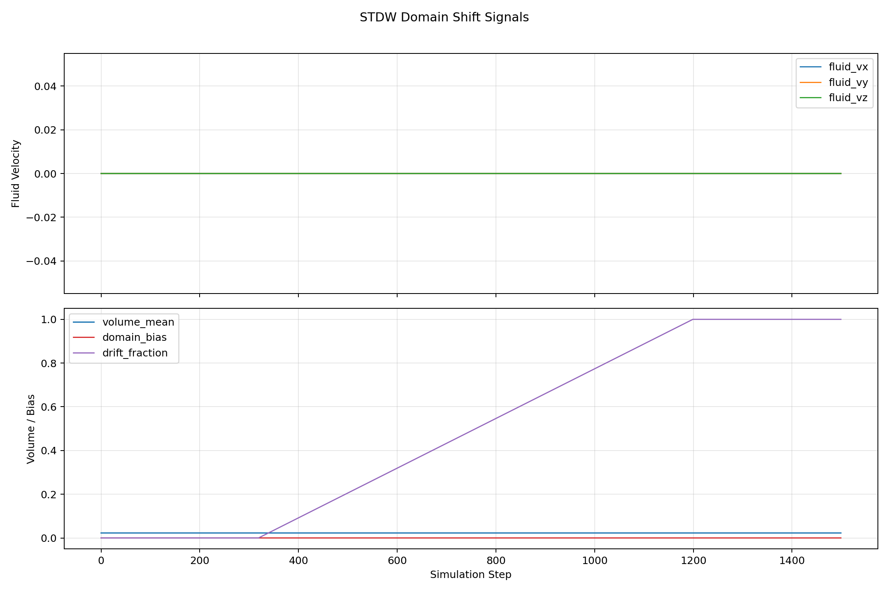
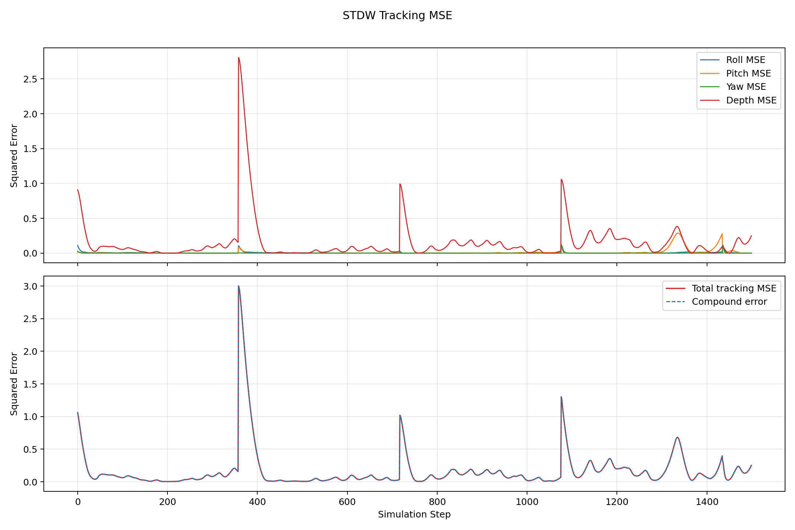

# 动态参数辨识必要性探索报告

日期：2026-06-13

## 1. 研究问题

前序 strong validation / ablation / followup 已经说明，`asymmetric + linear` 劣化的主因是 slow-loop 在错误 drift 方向上持续学习；router 和 COM-COB micro-probe 的 conservative fallback 可以消除这类错误方向失败。

本轮问题进一步收窄为：当扰动来自 `density`、推进器效率、推进器角度变化时，现有 online adaptation 是否需要更多参数辨识，而不仅是 COM-COB drift 方向选择。

约束：

- 不重训。
- 不改 RL observation 维度。
- probe 严格 observable-only，不读取 true density、true thruster fault、true angle 或 true torque pulse。
- torque pulse 作为 negative control，不纳入第一轮参数估计。
- 若 probe 参与修复，只允许 evidence-gated conservative gating；证据不足必须回退。

## 2. 实现与验证产物

代码新增/补完：

- `workflows/param_probe.py`：observable-only parameter-family probe，并加入分层检测。
- `workflows/sweep_dynamic_param_id.py`：12-cell 小矩阵。
- `workflows/tools/aggregate_dynamic_param_id.py`：聚合与报告。
- `workflows/play_stdw_adapt.py`：接入 `param_probe_*` summary/CSV 字段、thruster angle scenario override、默认关闭的主动小幅激励，以及证据门控的 conservative gating。
- `easyuuv_env.py` / `workflows/scenarios.py` / `workflows/disturbance_schedule.py`：runtime thruster angle shift 与 schedule snapshot。

验证：

- `python -m py_compile ...` 通过。
- `python workflows/scenarios.py --self-test` 通过。
- `python workflows/disturbance_schedule.py --self-test` 通过。
- `python workflows/sweep_dynamic_param_id.py --dry_run` 通过，生成 12 cell 命令。
- thruster angle 80-step smoke 通过，CSV 中 `thruster_angle_shift_rad=0.0872664626, thrusters=4, axis=yaw`。
- rollback smoke 通过：默认 `param_probe_active_excitation=False`，不改变动作。
- 主动激励 + 分层检测 smoke 通过：当输出 `ambiguous` 时，`param_probe_gate_slow_loop=False`，`gate_silenced_count=0`。

结果产物：

- `.results/exp_dynamic_param_id_active_v3_20260613/dynamic_param_id_runs.csv`
- `.results/exp_dynamic_param_id_active_v3_20260613/dynamic_param_id_summary.csv`
- `.results/exp_dynamic_param_id_active_v3_20260613/dynamic_param_id_report.md`

## 3. 小矩阵结果

矩阵：4 scenario × 3 mode = 12 cell，全部 `returncode=0`。

| family | full | off | param_probe | probe selected | gate | 结论 |
|---|---:|---:|---:|---|---|---|
| density | 0.2426 | 0.2879 | 0.2426 | ambiguous | False | 主动激励后仍不可分；安全回退到 full 行为 |
| thruster_efficiency | 0.3050 | 0.2909 | 0.3050 | ambiguous | False | 主动激励后仍不可分；安全回退到 full 行为 |
| thruster_angle | 0.3129 | 0.3156 | 0.3129 | ambiguous | False | 主动激励后仍不可分；安全回退到 full 行为 |
| torque negative control | 0.3158 | 0.3191 | 0.3158 | ambiguous | False | 未误分类为参数族；安全回退到 full 行为 |

最终 active_v3 中所有 param_probe case 的 reason 都是：

```text
layer2_nonseparable_persistent_shift best=density score~=0.321-0.325 margin~=0.080-0.084 persistent_shift~=0.979-0.980
```

主动小幅激励使用 `magnitude=0.02`、channels `0,1,2,3`、period `20`。四类 case 的 observable features 仍高度相似，margin 小于保守接受阈值，所以 4/4 个 param_probe case 回退 `ambiguous`，不触发 slow-loop gate。

代表性 case（density / linear / asymmetric，param_probe 模式）的逐步证据：





> 左图：domain-shift 检测器识别到持续偏移（persistent_shift≈0.98），但 family score margin 仅约 0.08，低于保守接受阈值；右图：因判定 `ambiguous` 回退，param_probe 的 rolling MSE 基本贴近 full 行为，未被 gate 错误改写。这两张图来自 `.results/exp_dynamic_param_id_active_v3_20260613/density_linear_asymmetric_param_probe/`。

## 4. 机制解释

第一，当前 A3 history + executed action + compound error 即使加入很小的 deterministic dither，也不足以可靠区分 `density`、`thruster_efficiency` 和 `thruster_angle`。三类动态参数以及 torque negative control 在本矩阵中都表现出相近的 depth/attitude/effort 特征，family score margin 只有约 0.08。

第二，conservative gating 是安全边界而不是参数修复。早期版本把 `ambiguous` 也 gate，虽然 density case 变好，但推进器效率、推进器角度和 torque negative control 变差；最终版本将 `ambiguous` 定义为回退状态，不 gate、不补偿，因此 param_probe 性能基本贴近 full。

第三，torque pulse 作为 negative control 的设定是合理的。最终版本没有把 torque negative control 强行写成 density/thruster family，也没有触发 gating；因此论文中不应把间歇 torque pulse 写成可稳定估计的动态参数。

## 5. 对用户问题的回答

当前证据支持以下判断：

1. `torque`、`density`、`thruster angle` / `thruster efficiency` 的 linear 劣化不能只用 COM-COB drift 方向问题解释。
2. 现有 online adaptation 若要应对动态 density / actuator geometry 场景，确实需要更多参数辨识机制；但当前 A3 被动历史 + 小幅动作 dither 仍不够。
3. 更合适的下一步不是把当前 probe 直接做成补偿器，而是引入更强可分辨信息：
   - 更结构化的主动激励，用于区分 global density scale 与局部 actuator fault。
   - 更丰富传感，如电机转速/电流、局部推力估计、DVL/水速、IMU 高频统计。
   - 更严格分层检测：先区分 persistent parameter shift 与 impulse disturbance，再做 family identification。
4. 本轮 conservative gating 只保留为安全防护：证据不足时必须回退，不允许把 `ambiguous` 解释成修复信号。

## 6. 论文建议表述

建议采用保守表述：

- Current STDW with router/probe solves the wrong-direction COM-COB drift failure.
- Dynamic density and actuator-geometry changes expose a separate limitation: A3 histories plus small deterministic dithers are not sufficient to robustly identify the parameter family.
- Conservative slow-loop gating must be evidence-gated; ambiguous probe outputs should fall back without modifying the slow loop.
- Handling dynamic density and thruster-angle/efficiency changes likely requires an explicit parameter-identification layer, richer sensing, or more structured active excitation.

不建议表述为：

- “param_probe 已能准确辨识 density/thruster angle。”
- “conservative gating 已修复所有 dynamic parameter shifts。”
- “torque pulse 可作为稳定参数估计目标。”
