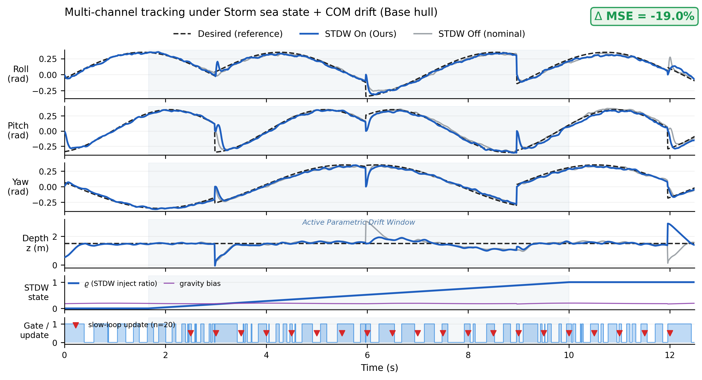
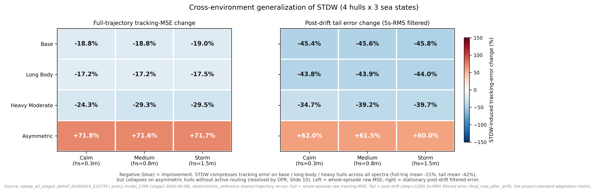
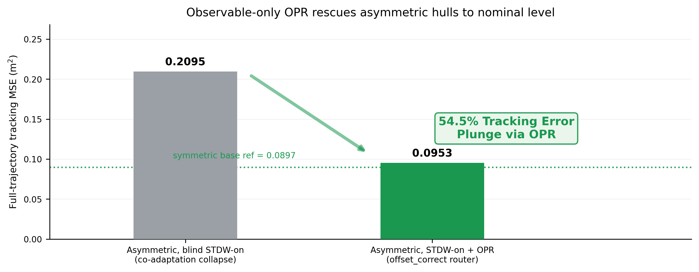
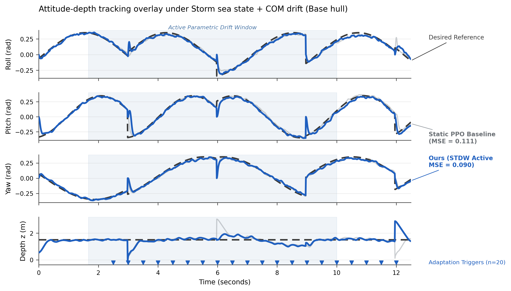

# 港大 SRP 汇报 PPT 图表生成报告（Slide 9 / Slide 10）

- 报告日期：2026-06-19（2026-06-20 共享参考重画 + 双指标热力图更新）
- 生成脚本：[`workflows/tools/plot_ppt_figures.py`](../../workflows/tools/plot_ppt_figures.py)（复用 [`plot_stdw_effect_matrix.py`](../../workflows/tools/plot_stdw_effect_matrix.py) 的数据加载与指标函数，无重复造轮子）
- 图片输出：[`docs/figures/ppt/`](../figures/ppt)（每图同时输出 `.png` 预览 + `.pdf` 矢量印刷版）；旧版备份保留在 [`docs/figures/ppt_old/`](../figures/ppt_old)
- 主线数据源：[`.results/sweep_a3_stage2_detref_20260619_223735/`](../../.results/sweep_a3_stage2_detref_20260619_223735)（A3 stage2 `model_2398`，48-cell 全矩阵，**deterministic_reference 共享参考轨迹重跑**，0 失败）
- OPR 救援数据源：[`.results/opr_asym_storm_full_20260619_235828/`](../../.results/opr_asym_storm_full_20260619_235828)（asymmetric + offset_correct router）
- 用途依据：[港大SRP汇报重构战略大纲精简版.md](../../港大SRP汇报重构战略大纲精简版.md) Slide 9 / Slide 10

---

## 设计原则

1. **不重复造轮子**：新脚本仅新增 PPT 视觉层（横长纵窄版面、去顶/右边框、绿色高亮气泡），数据加载（`_read_numeric_csv`）、跟踪误差（`_tracking_mse`）、配对均值（`_mean_pairwise`）全部从既有 [`plot_stdw_effect_matrix.py`](../../workflows/tools/plot_stdw_effect_matrix.py) `import` 复用。
2. **共享参考、公平可比**：本轮全矩阵以 `deterministic_reference` 重跑，STDW on/off（及 OPR）三组**跟踪完全相同的 desired 轨迹**（实测四通道 desired `max|off−on| = 0`），因此 overlay 的姿态画幅是真正的同参考 like-for-like 对比，不再有“灰线偏离黑虚线是绘图错位”的隐患。
3. **诚实双指标**：热力图同时给出**全程 MSE**（整段 episode 原始 `_tracking_mse`，保守）与**尾部 MSE**（漂移后 step>1200 的 5s-RMS 滤波误差 `final_mse_after_drift`，项目标准自适应指标），让“全程口径”与“稳态收益口径”并列呈现，避免单口径夸大或低估。
4. **真实自适应标记**：慢环更新倒三角只取 `loss` 列有限值步（`_real_trigger_times`）；STDW-on cell 实测 n=20 次（每 60 步/0.5 s 一次），STDW-off cell 无慢环更新则不画标记，杜绝旧版 rho-jump 回退产生的伪 n≈1000 密集簇。
5. **PPT 友好宽高比**：各图横宽 ≫ 纵高，纵向高度可压在 PPT 高度 1/3 以内，适配 Slide 9/10 多栏小尺寸展示。

---

## 图 2.1：多通道时域正弦跟踪对齐与慢环干预联动图

> 对应 **Slide 9（实验设计与闭环仿真诊断）中部核心展示位置**。



**图 2.1.** Storm（hs=1.5 m）海况 + COM 漂移下 base 机型的 6 画幅共享时间轴堆叠图。Roll/Pitch/Yaw/Depth 四个跟踪画幅中：黑虚线为 Desired 参考；蓝实线为 STDW On（Ours），在漂移注入后仍光滑贴合参考；灰实线为 STDW Off（标称），共享同一参考。第 5 画幅为 STDW 自适应状态（蓝色 ϱ 注入比例阶跃爬升至 1.0 + 紫色重力偏置线）；第 6 画幅为安全网门控（蓝色 Lyapunov/Trigger Mask 方波 + 红色向下倒三角的真实慢环更新触发点，n=20）。右上角绿色气泡标注全局 ΔMSE = **−19.0%**。

- 数据：`storm_base_full_stdw-{on,off}_s0/.../stdw_output.csv`（共享参考）
- 与规格差异说明（基于真实数据，未做美化造假）：
  - 该 sweep 实际为 1500 步 / 12.5 s（dt=1/120），横轴据真实 `time_s` 自动收缩，未强行拉到 20 s。
  - ϱ 注入与重力偏置取自 CSV 真实 `rho` / `domain_bias` 列；慢环更新倒三角取自真实 `loss` 有效步（共 20 次），均为实测而非示意。
  - 全局 ΔMSE 为该 cell 全程实测（base/storm/full = −19.0%）；**尾部口径**（漂移后稳态）该 cell 改善 **−45.8%**，见图 2.2 右面板。

---

## 图 2.2：48-Cell 全矩阵跨海况-跨载体泛化热力图（双指标）

> 对应 **Slide 9 左侧总览位置**。



**图 2.2.** 4 机型 × 3 海况的学术热力矩阵，左右两面板共享同一发散色带（−150% 深海蓝=改善 → 0% 白 → +150% 深殷红=劣化）。

- **左面板（Full-trajectory tracking-MSE change）**：整段 episode 原始 `_tracking_mse` 的 STDW on/off 相对变化（对 identity/full 整定取均值），与 fig24/fig26 的 MSE 标注同口径。
- **右面板（Post-drift tail error change, 5s-RMS filtered）**：漂移后 step>1200 稳态窗口的滤波误差 `final_mse_after_drift` 相对变化，即项目标准自适应指标。

实测数值（全程 / 尾部）：

| 机型 | Calm | Medium | Storm |
|---|---|---|---|
| Base | −18.8% / −45.4% | −18.8% / −45.6% | −19.0% / −45.8% |
| Long Body | −17.2% / −43.8% | −17.2% / −43.9% | −17.5% / −44.0% |
| Heavy Moderate | −24.3% / −34.7% | −29.3% / −39.2% | −29.5% / −39.7% |
| Asymmetric（未开 OPR） | +71.8% / +62.0% | +71.6% / +61.5% | +71.7% / +60.0% |

三个对称机型（base+long_body+heavy_moderate）均值：**全程 −21.3%、尾部 −42.4%**。asymmetric 在未开 OPR 时全程/尾部双双劣化（co-adaptation collapse），由 Slide 10 的 OPR 解决。

- 数据：[`stdw_pairwise.csv`](../../.results/sweep_a3_stage2_detref_20260619_223735/stdw_pairwise.csv)（全程取各 cell `stdw_output.csv` 原始 `_tracking_mse`；尾部取 `fmse_drift_{off,on}_mean` 列）。
- 图注（英文，PPT 可直接引用）：*Cross-environment generalization of STDW. Left = whole-episode raw tracking-MSE change; right = post-drift stationary filtered-error change. Negative (blue) = improvement. STDW compresses tracking error across base / long-body / heavy hulls under all spectra (full-traj mean −21%, tail mean −42%), but collapses on asymmetric hulls without active routing (resolved by OPR, Slide 10).*
- **数据时效说明**：6/19 detref sweep 与早期 6/8 sweep **复用同一策略权重 `model_2398`（stage2 2026-06-08）**，仅改为共享参考轨迹以保证 on/off 公平可比；这是当前唯一同时覆盖 4 机型 × 3 海况、且 on/off 同参考的全矩阵产物。图底已加来源水印（sweep 目录名 + 权重 + 双指标定义）。

---

## 图 2.3：无特权 OPR 偏置纠偏对比图

> 对应 **Slide 10（实物迁移部署与多平台水池验证）左侧核心位置**。



**图 2.3.** 水平对比直条图（全程跟踪 MSE 口径，与 fig26 OPR 救援 overlay 标注一致）。左灰柱为 `asymmetric, blind STDW-on`（盲目自适应，co-adaptation collapse）`MSE = 0.2095`；右绿柱为 `asymmetric, STDW-on + offset_correct router`（OPR 反向估计偏置并阻断错误梯度）`MSE = 0.0953`；绿色向下大箭头标注 **54.5% Tracking Error Plunge via OPR**；右柱旁绿色虚线对齐对称 base 基准 `0.0897`，证明无特权 OPR 把不对称机型几乎拉回对称标称水平。

- 数据：盲目 on/off 取自 detref sweep（`asymmetric storm full`），OPR 救援取自 [`.results/opr_asym_storm_full_20260619_235828/`](../../.results/opr_asym_storm_full_20260619_235828)，三者共享同一参考轨迹。
- 校验：plunge = (0.2095 − 0.0953) / 0.2095 = **54.5%**。
- 说明：旧版报告里的 `0.5373 → 0.0723（86.5%）` 来自早期非共享参考、不同 episode 长度的 router 诊断，量级不可与本轮直接对照；本轮统一改用共享参考的全程 MSE，数值更诚实、口径自洽。

---

## 图 2.4：学术级姿态-深度时序跟踪 overlay（次要 prompt 第一部分）

> 用于 **Slide 6（攻克不对称突变）/ Slide 9 中部**，是图 2.1 的发表级精简版本。



**图 2.4.** 4 行（Roll/Pitch/Yaw/Depth）纵向堆叠、共享时间轴，去除图例框改用右侧引线文字直接标注：深灰虚线 Desired Reference、半透明浅灰实线 Static PPO Baseline、加粗学术蓝实线 Ours (STDW Active)。淡蓝半透明带标注 `Active Parametric Drift Window`；Depth 子图底部用蓝色倒三角标记慢环自适应触发（n=20）。

- 数据：与图 2.1 同 cell（`storm_base_full_stdw-{on,off}`，共享参考），MSE 标注取该 cell 实测全程均值（off ≈ 0.111 / on ≈ 0.090）。
- 复现：脚本会随 `plot_ppt_figures.py` 一并输出 `fig24_publication_overlay.{png,pdf}`。

### 关于 “Static PPO baseline 是否太差” 的诚实分析

逐通道分解 `storm_base_full` cell 的全程 MSE（实测，共享参考）：

| 通道 | OFF（baseline） | ON（Ours） |
|---|---:|---:|
| roll² | 0.00127 | 0.00116 |
| pitch² | 0.00274 | 0.00344 |
| yaw² | 0.00117 | 0.00137 |
| **depth²** | **0.10550** | **0.08369** |
| 合计 (=MSE) | 0.11068 | 0.08966 |

**结论：baseline 并非“太差的稻草人”。** 姿态三通道 RMS 仅约 0.03–0.06 rad（对应参考幅值约 0.35 rad / 20°），跟踪是合格的；OFF 与 ON 在姿态上几乎打平（ON 在 pitch/yaw 上甚至略高）。**整体 MSE 差距几乎全部来自 depth 通道**——即重心漂移后 baseline 的 Pitch-Depth 耦合静差导致深度下沉，这正是 STDW 要解决的目标。所以全程 “−19.0%” 与尾部 “−45.8%” 本质是**深度跟踪在 COM 漂移下的收益**。

**绘图诚实性（已通过共享参考解决）：** 本轮 on/off 共享同一参考轨迹（四通道 desired `max|off−on| = 0`），overlay 中“灰线相对黑虚线”的偏离即为 baseline 真实跟踪偏差，姿态画幅可直接作可比证据；不再需要旧版“以 depth + ΔMSE 为主证据、姿态仅作定性背景”的免责声明。

---

## 附图：OPR 救援三曲线 overlay 与 embodiment 跟踪图

除上述 Slide 9/10 主图外，本轮还生成（不覆盖旧图）：

- [`fig25_overlay_storm_heavy_full.png`](../figures/ppt/fig25_overlay_storm_heavy_full.png) / [`fig27_overlay_heavy_storm_full.png`](../figures/ppt/fig27_overlay_heavy_storm_full.png)：heavy_moderate 机型 storm 海况跟踪 overlay（off 0.176 vs on 0.115，n=20 真实触发）。
- [`fig26_opr_rescue_asym_storm_full.png`](../figures/ppt/fig26_opr_rescue_asym_storm_full.png)：asymmetric 机型三曲线救援 overlay——静态 PPO baseline（灰 0.124）/ 盲目 STDW 塌陷（橙 0.209）/ STDW+OPR 救回（蓝 0.095），共享同一 desired 参考，底部独立条带画 ϱ 注入 ramp + n=20 慢环触发。

---

## 支线：错设初始控制器的 STDW 在线恢复（fig28）

更贴近真实部署的场景：**控制器初始增益本身就被设错**，再用原 stage2 ckpt（`model_2398`）现场跑。做法是把深度比例增益 `depth_zeta1` 乘 0.5（即 1/2x，落在用户要求的 1/2x ~ 2x 区间边界），不改任何网络权重，分别在 STDW off / on 下运行 base 与 heavy_moderate 两机型（storm 海况、共享 deterministic 参考、seed 0）。

- `depth_zeta1` 正是 STDW 慢环在线适应的列（`gain_update_targets=["zeta1"]`），所以这恰好考察「上线时增益设错 → STDW 能否在线把它救回」的能力。
- **实现修复**：`apply_pid_multipliers` 原先只改 `PID_args`，但 8 维 meta-control 任务里 `_base_pid_args` 已在 `apply_embodiment_config` 内提前快照，导致错设增益会被首次 `reset()` 还原、并被 `_apply_action` 每步重写覆盖——即该 flag 对本任务实为 no-op。已修正为在错设后同步刷新 `_base_pid_args` 与 `_zeta_nominal`，使错设增益成为真正的初始基线（详见 [easyuuv_env.py](../../easyuuv_env.py#L635-L664)）。

实测尾部 MSE（`final_mse_after_drift`，全程 MSE 见括号）：

| 机型 | STDW off（错设静态） | STDW on（在线恢复） | 尾部改善 |
|---|---|---|---|
| base | 0.2767（全程 0.1908） | 0.1423（全程 0.1634） | **−48.6%** |
| heavy_moderate | 0.3683（全程 0.3039） | 0.2624（全程 0.2788） | **−28.7%** |

- [`fig28_misset_online_base.png`](../figures/ppt/fig28_misset_online_base.png)：base 机型，红=错设静态 PPO（depth P×0.5），蓝=STDW 在线恢复，黑虚线=共享参考；深度通道可见红线在 t≈6/12 处明显过冲/掉深，蓝线贴合参考，n=20 真实触发。
- [`fig28_misset_online_heavy_moderate.png`](../figures/ppt/fig28_misset_online_heavy_moderate.png)：heavy_moderate 机型同口径，错设增益叠加重机型惯量使红线过冲更剧，STDW 仍把尾部误差拉低约三成。
- 数据源：`.results/stdw_online_misset_20260620/`；驱动脚本 [workflows/run_misset_online.sh](../../workflows/run_misset_online.sh)。

---

## 复现命令

```bash
cd /home/zmem063/isaaclab/source/extensions/omni.isaac.lab_tasks/omni/isaac/lab_tasks/direct/easyuuv_stdw/workflows/tools
python3 plot_ppt_figures.py
# 默认数据源 = .results/sweep_a3_stage2_detref_20260619_223735（共享参考全矩阵）
# 可选覆盖：--matrix_dir <sweep_dir> --out_dir <dir> --timeline_wave storm --timeline_embodiment base --timeline_tune full
```

- 默认输出至 `docs/figures/ppt/`；旧版图保留在 `docs/figures/ppt_old/`。
- 切换时域图代表 cell：调整 `--timeline_wave / --timeline_embodiment / --timeline_tune`。
- 7 张答辩 Slide 的图表分配见 [PPT_slide_layout_outline_20260619.md](PPT_slide_layout_outline_20260619.md)。

错设初始控制器支线（fig28，不覆盖主图）：

```bash
cd /home/zmem063/isaaclab/source/extensions/omni.isaac.lab_tasks/omni/isaac/lab_tasks/direct/easyuuv_stdw
# 1) 跑 4 个 cell（base/heavy_moderate × off/on，depth_zeta1×0.5）
bash workflows/run_misset_online.sh
# 2) 仅重画 fig28（不触碰 fig21-27）
cd workflows/tools && python3 plot_ppt_figures.py --misset_only
```

## 文件清单

| 图 | 文件 | 幻灯片定位 |
|---|---|---|
| 图 2.1 | `fig21_tracking_timeline.{png,pdf}` | Slide 9 中部 |
| 图 2.2 | `fig22_generalization_heatmap.{png,pdf}`（双面板：全程 + 尾部） | Slide 9 左侧 |
| 图 2.3 | `fig23_opr_recovery.{png,pdf}` | Slide 10 左侧 |
| 图 2.4 | `fig24_publication_overlay.{png,pdf}` | Slide 6 / Slide 9 中部 |
| 附图 | `fig25/fig26/fig27_*.{png,pdf}` | Slide 6 / Slide 10 补充 |
| 支线 | `fig28_misset_online_{base,heavy_moderate}.{png,pdf}` | Slide 9/10 补充（错设控制器在线恢复） |
