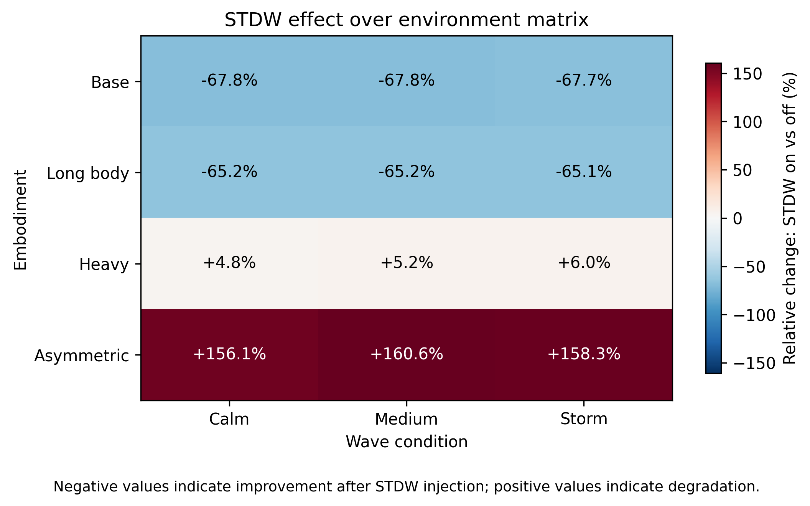
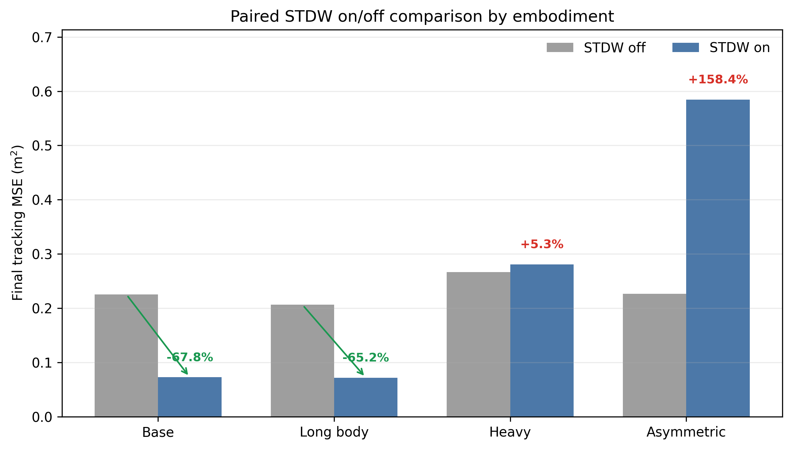
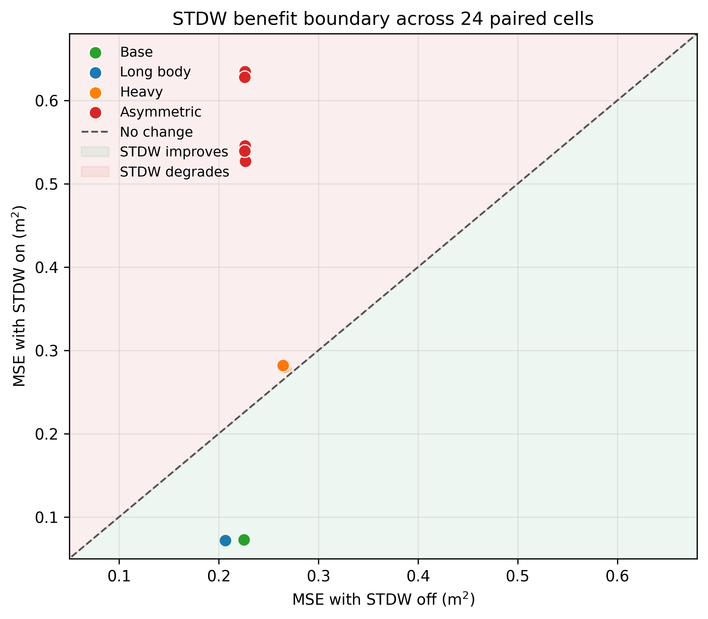
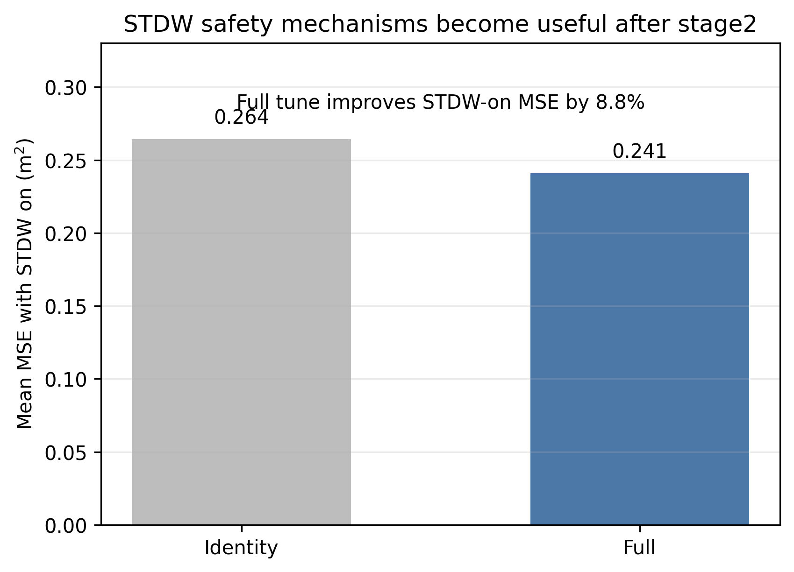
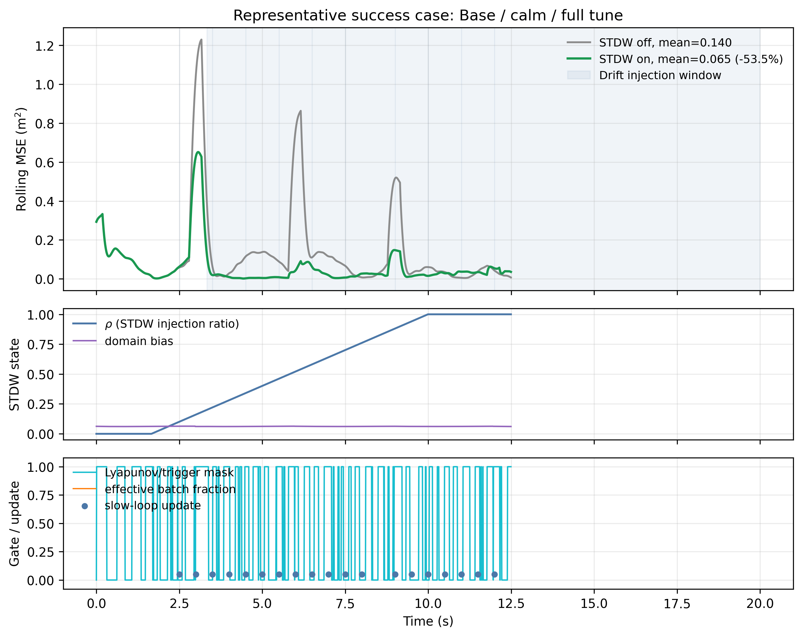
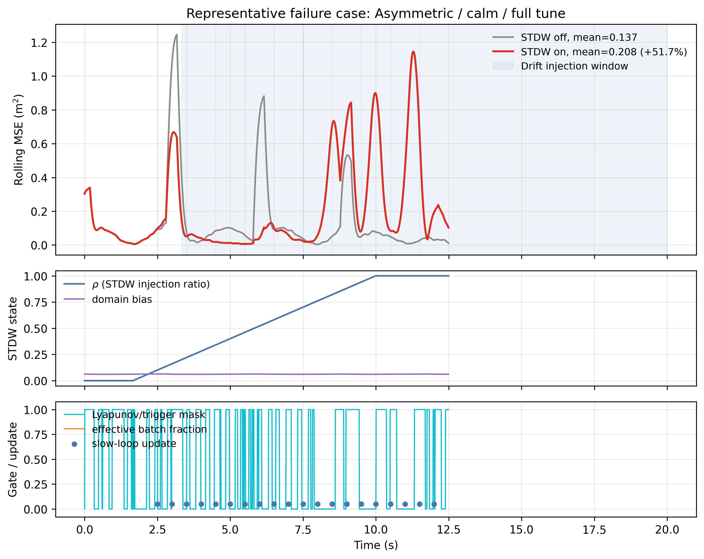
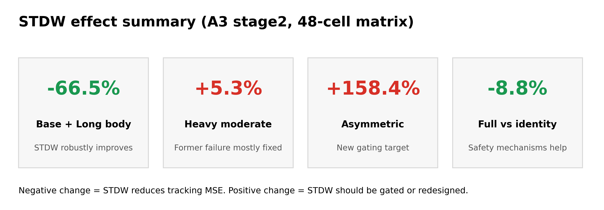
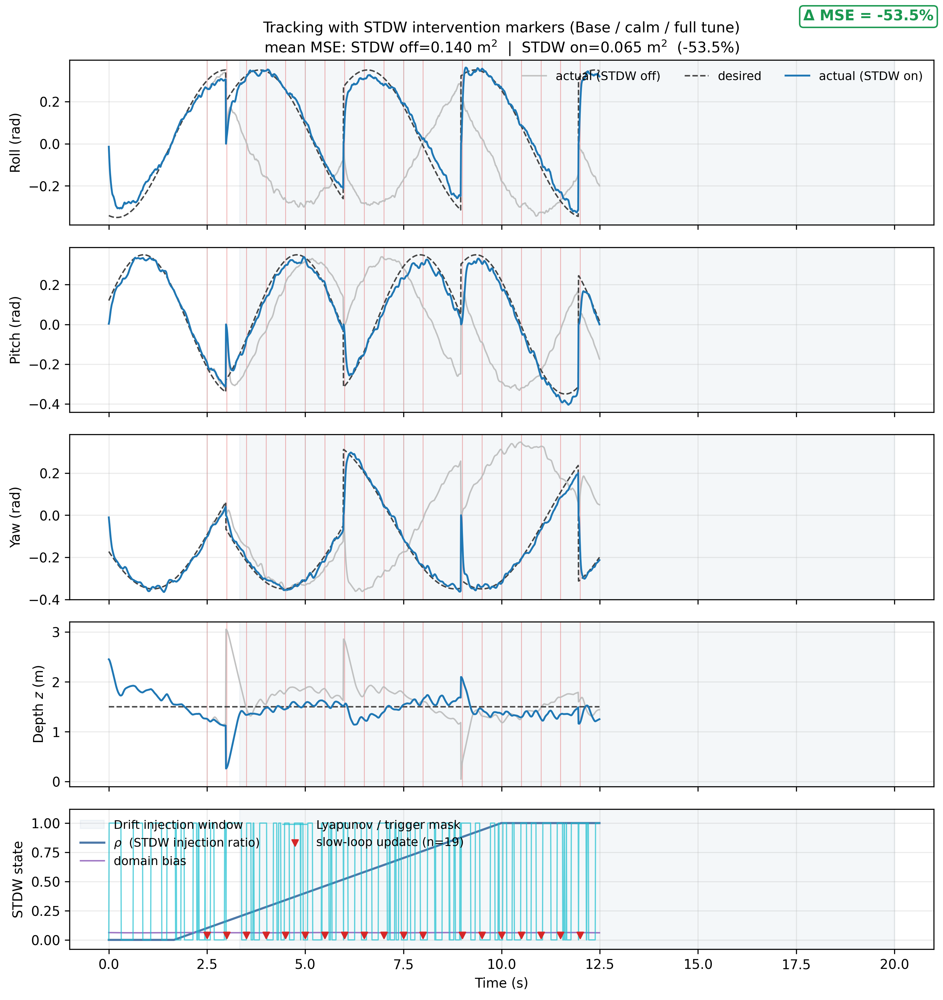
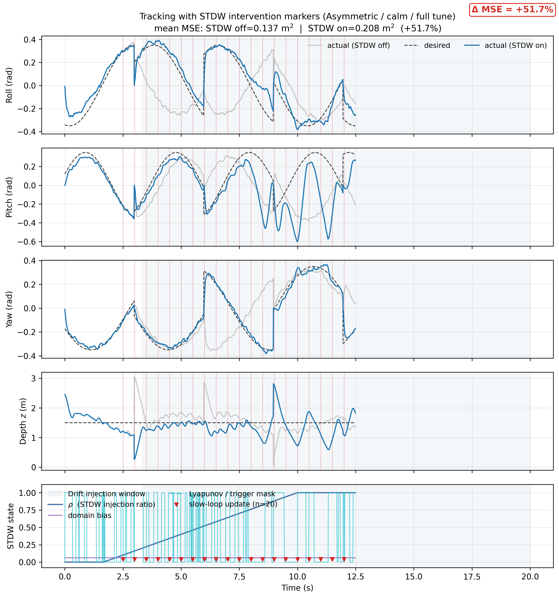

# STDW 起作用机制论文绘图说明（A3 stage2 × 48-cell）

- 生成日期：2026-06-08
- 数据来源：[`../.results/sweep_a3_stage2_20260608_142742/`](../../.results/sweep_a3_stage2_20260608_142742/)
- 图像目录：[`../.results/sweep_a3_stage2_20260608_142742/paper_figures/stdw_effect/`](../../.results/sweep_a3_stage2_20260608_142742/paper_figures/stdw_effect/)
- 生成脚本：[`../workflows/tools/plot_stdw_effect_matrix.py`](../../workflows/tools/plot_stdw_effect_matrix.py)
- 格式：每张图同时输出 `.png` 和 `.pdf`；论文排版优先用 PDF，实验汇报预览用 PNG。

---

## 1. 图组定位

当前已有的 `stdw_tracking_*` / `stdw_losses` 图主要展示单次 run 的内部轨迹，但没有直接回答：

- STDW 注入前后 MSE 到底下降了多少？
- 哪些环境下 STDW 起作用？
- 哪些环境下 STDW 反而应该被 gate？
- 慢环触发、rho 注入、drift 窗口和 MSE 变化是否同一时间发生？

本图组专门补齐这些“STDW 起作用”的证据链，建议与每次实验自动生成的跟踪图、loss 图搭配使用。

---

## 2. 生成命令

```bash
cd /home/zmem063/isaaclab/source/extensions/omni.isaac.lab_tasks/omni/isaac/lab_tasks/direct/easyuuv_stdw

python3 workflows/tools/plot_stdw_effect_matrix.py \
    --matrix_dir .results/sweep_a3_stage2_20260608_142742
```

默认输出目录：

```text
.results/sweep_a3_stage2_20260608_142742/paper_figures/stdw_effect/
```

---

## 3. 图像索引与论文用途

| Figure | 文件 | 核心信息 | 推荐用途 |
|---|---|---|---|
| Fig. 1 | [`fig1_stdw_delta_heatmap.pdf`](../../.results/sweep_a3_stage2_20260608_142742/paper_figures/stdw_effect/fig1_stdw_delta_heatmap.pdf) | STDW 在 4 embodiment × 3 wave 上的相对 MSE 改变量 | 总览：说明“哪里起作用，哪里反作用” |
| Fig. 2 | [`fig2_embodiment_on_off_bars.pdf`](../../.results/sweep_a3_stage2_20260608_142742/paper_figures/stdw_effect/fig2_embodiment_on_off_bars.pdf) | STDW off/on 配对条形图，带百分比标签 | 主结果：突出 base/long_body 的 −65%~−68% |
| Fig. 3 | [`fig3_stdw_benefit_phase_plane.pdf`](../../.results/sweep_a3_stage2_20260608_142742/paper_figures/stdw_effect/fig3_stdw_benefit_phase_plane.pdf) | 24 个配对 cell 的 benefit boundary，对角线下方表示 STDW 改善 | 机制边界：展示 asymmetric 落在反作用区 |
| Fig. 4 | [`fig4_tune_full_vs_identity.pdf`](../../.results/sweep_a3_stage2_20260608_142742/paper_figures/stdw_effect/fig4_tune_full_vs_identity.pdf) | full tune 比 identity 在 STDW-on 下净改善 8.8% | 消融：说明 PE/死区/LPF/β 安全机制开始有效 |
| Fig. 5 | [`fig5_base_full_timeline.pdf`](../../.results/sweep_a3_stage2_20260608_142742/paper_figures/stdw_effect/fig5_base_full_timeline.pdf) | 成功案例：rolling MSE、rho、domain bias、slow-loop update 同图 | 过程证据：展示 STDW 注入后真实起作用 |
| Fig. 6 | [`fig6_asymmetric_failure_timeline.pdf`](../../.results/sweep_a3_stage2_20260608_142742/paper_figures/stdw_effect/fig6_asymmetric_failure_timeline.pdf) | 反例：asymmetric 上 STDW 注入导致 MSE 上升 | 负面证据：支撑部署期 gating 的必要性 |
| Fig. 7 | [`fig7_stdw_summary_card.pdf`](../../.results/sweep_a3_stage2_20260608_142742/paper_figures/stdw_effect/fig7_stdw_summary_card.pdf) | 一页式数字摘要 | 答辩 / 附录 / 组会首页 |

---

## 4. 推荐论文叙事顺序

1. 先放 Fig. 1：说明 STDW 效果不是单点，而是矩阵级现象。
2. 再放 Fig. 2：量化 base/long_body 的直接收益与 asymmetric 的反向风险。
3. 接 Fig. 5：给出“STDW 起作用”的时间序列证据，展示注入窗口、rho 和 slow-loop 更新与 MSE 降低的对应关系。
4. 接 Fig. 3：把所有 24 个 off/on 配对放到 benefit boundary，说明 gating 边界。
5. 接 Fig. 6：用 asymmetric 反例解释为什么不能全局无脑启用 STDW。
6. 最后用 Fig. 4：作为 tune full 的消融证据，说明 stage2 后 8D gain head 进入工作区。

---

## 5. 图注草案

### Fig. 1



**Relative tracking-error change induced by STDW across the 48-cell environment matrix.** Negative values indicate that enabling STDW reduces final tracking MSE, while positive values indicate degradation. STDW consistently improves base and long-body embodiments across all wave conditions, but degrades the asymmetric embodiment.

### Fig. 2



**Paired STDW on/off comparison grouped by embodiment.** Enabling STDW reduces MSE by 67.8% on the base embodiment and 65.2% on the long-body embodiment, remains nearly neutral on the heavy embodiment, and strongly degrades the asymmetric embodiment, motivating an online gating mechanism.

### Fig. 3



**Benefit boundary of STDW over 24 paired cells.** Points below the diagonal line are improved by STDW. The base and long-body cells cluster well below the diagonal, whereas asymmetric cells lie above the diagonal, indicating that STDW must be conditionally activated.

### Fig. 4



**Effect of the full STDW tuning stack after stage-2 training.** Compared with the identity pass-through mode, enabling the full PE/dead-zone/LPF/beta stack reduces STDW-on MSE by 8.8%, showing that the gain-adaptation head has become responsive after stage-2 training.

### Fig. 5



**Representative successful STDW adaptation case.** The base/calm/full cell shows a clear reduction in rolling tracking MSE after the drift injection window starts. The rho schedule and slow-loop update markers demonstrate that the observed improvement aligns with STDW activation rather than random simulation variation.

### Fig. 6



**Representative STDW failure case under asymmetric mass-buoyancy offset.** Although the same STDW mechanism is activated, the rolling MSE increases relative to the off baseline. This failure case supports deployment-time gating or asymmetric-aware domain randomization.

### Fig. 7



**Compact summary of matrix-level STDW effects.** The card summarizes the robust improvement region, the repaired heavy embodiment failure, the newly exposed asymmetric failure, and the usefulness of the full STDW tuning stack.

### Fig. 8



**纯跟踪曲线（roll / pitch / yaw / depth）+ STDW 慢环介入标记，成功案例（base / calm / full tune）。** 顶部四个分面分别画 desired（虚线）、actual under STDW on（蓝实线）、actual under STDW off（灰实线）三条线；底部 marker 面板叠加 `rho` 注入比例曲线、Lyapunov / trigger mask、慢环触发刻度（红色 ▽ 散点）以及 drift injection 窗口（蓝色阴影）。该图直接呈现"STDW 慢环每次触发后跟踪误差如何收敛"，与 §7.6 的论述一一对应。右上角 Δ MSE 标签直观显示 STDW 注入相对裸控制的下降幅度。

### Fig. 9



**纯跟踪曲线 + STDW 慢环介入标记，失败案例（asymmetric / calm / full tune）。** 与 Fig. 8 同构，但 actual under STDW on（蓝实线）相对 desired 漂移变大、且 Δ MSE 标签为红色正值，直观说明 STDW 在 asymmetric 配重下被 drift target 错配为外部扰动；该图与 Fig. 6 一道支撑 P1（部署期 gating）的必要性。

---

## 6. 与原始实验图的配合方式

建议每个关键 cell 使用以下组合：

| 目的 | 图像组合 |
|---|---|
| 证明 STDW 起作用（trajectory 视角）| Fig. 8 + 对应 cell 的 `stdw_tracking_rpy.png` + `stdw_tracking_depth.png` |
| 证明 STDW 起作用（aggregate 视角）| Fig. 5 + Fig. 1 + Fig. 2 |
| 证明 STDW 不应无脑开启（trajectory 视角）| Fig. 9 + asymmetric cell 的 `stdw_tracking_rpy.png` |
| 证明 STDW 不应无脑开启（aggregate 视角）| Fig. 6 + Fig. 3 |
| 证明矩阵级稳健性 | Fig. 1 + Fig. 2 + `stdw_pairwise.csv` |
| 证明 tune full 有效 | Fig. 4 + `stdw_pairwise.csv` identity/full 配对 |

---

## 7. 后续增强建议

- 若要进入论文主文，建议补 3 seed 后复用同一脚本生成 mean±std 版本。
- 若要强化“在线注入”证据，可在 `plot_stdw_effect_matrix.py` 中增加 `loss_target/loss_source/loss_reg` 的 inset。
- 若要服务部署策略，可基于 Fig. 3 增加 `fmse_short < 0.10` gating 阈值线。
